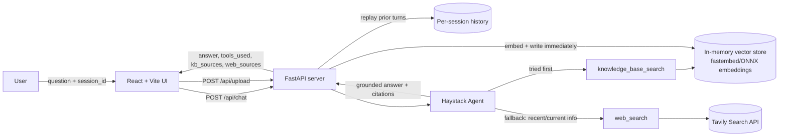

# Agentic RAG + Web Search Assistant

An agent that answers questions by searching a private local knowledge base first, and
falling back to live web search only when the knowledge base can't help. Built to
demonstrate agentic tool-routing, grounded/cited answers, and honest refusal when neither
source has the information.

**Live demo:** https://agentic-rag-web-assistant.onrender.com/ (Render free tier — the
instance sleeps after idle, so the first request may take ~30-60s to cold-start)

Features:
- Retrieval-first agent with live web fallback and per-answer source citations
- Server-side, per-session conversation memory (multi-turn follow-ups work; sessions are isolated from each other)
- Upload a PDF from the UI and it's embedded into the *live* knowledge base immediately — no restart or redeploy
- Auto-focus: start typing anywhere on the page and keystrokes land in the chat input

## How it works



The agent is instructed to always try `knowledge_base_search` first, and only reach for
`web_search` when the knowledge base has nothing relevant or the question is about
something that could have changed since the documents were written. Every response
returns which tool(s) were used and the underlying sources (file + snippet + similarity
score for the knowledge base, title + URL for the web), so answers are traceable rather
than opaque.

## Tech stack

| Layer | Choice |
|---|---|
| Agent framework | [Haystack](https://haystack.deepset.ai/) `Agent` with tool calling |
| LLM | Groq-hosted `openai/gpt-oss-20b` (OpenAI-compatible endpoint) |
| Embeddings | `BAAI/bge-small-en-v1.5` via [fastembed](https://github.com/qdrant/fastembed) (ONNX runtime, no torch/CUDA) |
| Vector store | Haystack `InMemoryDocumentStore` |
| Web search | [Tavily](https://tavily.com/) |
| API | FastAPI |
| Frontend | React + Vite + TypeScript |
| Packaging | Single multi-stage Dockerfile (frontend build → bundled into the API image) |

## Project structure

```
src/          agent definition, tools (KB search, web search), config, ingestion
server/       FastAPI app (/api/chat, /api/health, serves the built frontend)
frontend/     React + Vite chat UI
data/         source PDFs indexed into the knowledge base
eval/         eval set + runner for measuring retrieval/routing quality
Dockerfile    multi-stage build: frontend -> static assets, backend -> API + index
render.yaml   Render Blueprint for one-step deploy
```

## Running locally (without Docker)

```bash
python -m venv .venv && source .venv/bin/activate
pip install -r requirements.txt
cp .env.example .env   # fill in GROQ_API_KEY and TAVILY_API_KEY

python -m src.ingest    # builds the embedding index from data/*.pdf
uvicorn server.main:app --reload --port 8000
```

In a separate terminal, run the frontend dev server:

```bash
cd frontend
npm install
npm run dev   # http://localhost:5173
```

## Running with Docker

```bash
docker build -t agentic-rag-web-assistant .
docker run --rm -p 8000:8000 \
  -e GROQ_API_KEY=your_key \
  -e TAVILY_API_KEY=your_key \
  agentic-rag-web-assistant
```

The image builds the frontend and bakes the embedding index in at build time, so the
container is self-contained — visit `http://localhost:8000` for the full app (UI + API
on the same origin).

## Deploying

This repo includes a `render.yaml` Blueprint. On [Render](https://render.com/):
`New +` → `Blueprint` → connect this repo → set `GROQ_API_KEY` and `TAVILY_API_KEY` in
the service's environment variables → deploy. Render builds the Dockerfile directly.

The embedding backend is `fastembed` (ONNX runtime) rather than `sentence-transformers`
(PyTorch) specifically because of this: the default PyPI `torch` wheel on Linux bundles
CUDA libraries that are unused for CPU inference but pushed the process well past
Render's free-tier 512MB limit, causing repeated OOM restarts. Measured locally under an
actual 512MB cgroup limit, this stack runs at ~260-280MB — see commit history for the
before/after.

## Evaluating retrieval quality

`eval/eval_set.json` has 12 hand-written questions across four categories:

- **kb** — answerable only from the local PDF knowledge base (checks retrieval works and the agent picks the right tool)
- **web** — requires current information not in the knowledge base (checks web fallback)
- **hybrid** — needs both sources combined
- **refusal** — asks for something neither source has, to check the agent says so instead of guessing

Run it with:

```bash
python -m eval.run_eval
```

Each case checks both **tool routing** (did it call the tool(s) the question actually
requires) and **answer content** (does the answer contain the expected grounded facts).
Results are printed to stdout and written to `eval/results.json`.

**Latest run: 11/12 passed** (`kb`, `web`, and `hybrid` categories pass consistently; the
`refusal` cases are flaky, typically failing 0-2 of the 2).

The failure(s) are a real and informative finding, not a harness bug: "Project Aurora" is
a generic codename, so Tavily's web search surfaces unrelated real entities using the
same name (a browser engine, a self-driving company, etc.), and the agent confidently
answers with facts about *those*, instead of recognizing the name collision and saying
the knowledge base/web have no information about *this* Project Aurora. This is a known
limitation of naive knowledge-base + web-search fallback for internal-only codenames
that happen to collide with public entities — a system prompt change to explicitly check
for name-scope mismatches would be the fix, not attempted here to keep this eval an
honest measurement rather than a tuned-to-pass one.
